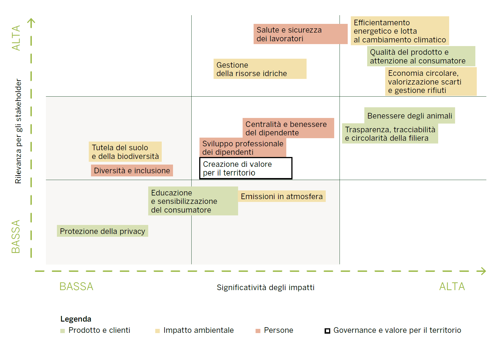

# SustiNEO Extractor
A `python` software for materiality matrices extraction.

## Table of Contents
- [Description](#description)
- [Usage](#usage)
  - [Dependencies](#dependencies)
  - [Installation](#installation)
  - [Execution](#execution)
  - [Docker](#docker)
- [Author](#author)


## Description
This `python` software can be used to extract data from block-form materiality matrices, like the one that follows.



The software follows 5 different passes:
1. [Plot/legend subdivision](#1-plotlegend-subdivision)
2. [Plot interpretation](#2-plot-interpretation)
3. [Legend interpretation](#3-text-detection)
4. [Final export](#4-final-export)

### 1. Plot/legend subdivision
At first, in order to have higher scalability, the input image is **divided** into two section: plot and lagend. 

More specifically, a "bounding box" approach has been choosen: using the **Hough transform** (after binarizing the input image), the software is able to detect all the lines on the image. Being a $(3 \times 3)$-blocks plot, is very easy to detect these lines.\
Next, the intersections are computed and between them, the software detects the minimum-area box of the plot, the one on the bottom-left. Using this rectangle, is then used a 1:3 aspect ratio to find the entire area of the plot: in particular, the subdivision is done using the three limiting vertices of the rectangle including the plot (top-left, bottom-left, top-right). 


Finally, the cropped plot and legend sections of the image are passed as input to the data-extraction module of the software.

### 2. Plot interpretation
#### 2.1. Shape detection
At first, the data-extraction `PlotOCR` class (that inherits from `OCR` class) object does a shape detection operation onto the plot file data.\
In particular, after **binarizing** the input plot (again, but using a different threshold in order to obtain the shapes of the rectangles in the image) and using a **$(2 \times 2)$-kernel dilatation** (in order to remove the thin lines), all the corners are extracted.

There are two different cases:
- **simple case**, rectangle on the plot: the limiting vertices (top-left and bottom-right ones) of the rectangle are detected and then used to define `LabelBox`-class objects for every detected rectangle;
- **complex case**, irregular form on the plot: this is the case in which the rectangles are joined between them; here, the software analyzes and then subdivides the 8-edges irregular shape, in order to obtain two rectangles and proceed like in the previous case.

#### 2.2. Text detection
Another **threshold** operation is done, but this time in manner to leave only the text and ignore the shape. Also during this pass we have two different cases:
1. **black text** on **colored rectangles**: the binarized image has exclusively black text, without any background (as it is discarted during the thresholding);
2. **white text** on **colored rectangles**: the binarized image has white text on black boxes.

As the OCR module works better with black-texted images, in the 2nd case the image is converted to negative in order to proceed like in the 1st one. 

Next, calling the `pyTesseract` module (python implementation for Google's *Tesseract OCR*), we are able to obtain a **dictionary** containing different informations about the words on the box, their respective pixel-coordinates, and bounding boxes informations.\
All these informations are used to instantiate `TextBox` class objects for every detected word; then, bounding box and respective coordinates are used to detect which word is contained in which colored box, and thus in which `LabelBox`, forming then the label.

Meanwhile, for every rectangle in the plot is saved the color data (both in RGB and HSV format) and stored in the `color_rgb` and `color_hsv` attributes of every single `TextBox`-class objects. This information will be used in the next part.

All the `LabelBox`es data are given as output.

### 3. Legend interpretation
The extraction now involves the legend section previously cropped from the source image. The data is passed as input to the `LegendOCR` class (inherits from `OCR` class) object.
Its behavior is similar to the previously analyzed class' one, but this time we don't consider `LabelBox`es, as we don't have actual rectangles in the image.

At first, calling the `pyTesseract` module, we obtain the same kind of dictionary obtained in the previous pass.
In the legend, the data appears in the following manner:

```
+---------------+
| Colored shape |   Label text
+---------------+
```

So, first we have to store the colored shape's position: this can be done converting the legend in HSV color-space format, and then taking the non-zero point for every color in `colors_hsv` obtained during the plot extraction pass.
Next, we can process the legend; kwowing that the first `TextBox` of every single legend-string is next near to the color shape, the euclidean distance between them is minimum; to avoid errors, we can here use a threshold. Given this minimum distance, we know that the first word of the label is of that label of the legend: so, we can create a `LegendBox` object identified by the position of the colored shape.

All the `LegendBox`es data are then given as output.

### 4. Final export
During the final export, the `LabelBox`es and the `LegendBox`es data are passed as input to the `Exporter` class object.
The following operations are then done.

#### 4.1. Normalization
The coordinates of the `LabelBox`es' middle points are **normalized** in the range $[0,300]$, in order to have 100 units for each block (vertically and horizontally).

#### 4.2. CSV export
The collected data are gathered in a `pandas` **dataframe** and then exported in a `csv` file on the disk.

#### 4.3 PNG export
The `pandas` dataframe data are used to generate a plot using the `matplotlib` module, that is then saved on the disk.

## Usage
### Dependencies
- Python 3.10
- `tesseract-ocr` package
- `opencv-python` python module
- `pytesseract` python module
- `matplotlib` python module

### Installation
At first, you need to install the `tesseract-ocr` package, using the package manager of your distribution.\
Example with Debian:

```
sudo apt install tesseract-ocr -y
```

If you want to add support for your language, you have to install the appropriate language

```
sudo apt install tesseract-data-LAN -y
```

where `LAN` are the first three characters of your language.

Example with Italian language:

```
sudo apt install tesseract-data-ita -y
```


After ensuring that Python $\geq$ 3.10 is installed on your personal environment, install the required modules through the command:

```
pip install -r requirements.txt
```

Then, make a `git clone` of this repository or simply download it.

### Execution
Run the `main.py` script in the root of the cloned folder to execute the program.

#### Help
```
python main.py -h

usage: main.py [-h] [-l LANGUAGE] [-d DEBUG_MODE] [-s SIZE_FACTOR] filename

This program extracts data from materiality matrices and reinterprets them in a more undestandable form.                                            
Author: nebuchadneZZar01 (Michele Ferro)                                            
GitHub: https://github.com/nebuchadneZZar01/

positional arguments:
  filename

options:
  -h, --help            show this help message and exit
  -l LANGUAGE, --language LANGUAGE
                        language of the plot to extract (default="ita")
  -d DEBUG_MODE, --debug-mode DEBUG_MODE
                        activate the visualization of the various passes (default=false)
  -s SIZE_FACTOR, --size-factor SIZE_FACTOR
                        if used in debug mode, the image sizes will be divided by the choosen scale factor for a better visualization on lower resolution screens (default=1.5)
```

#### Input
The input files can be stored in the `/src` folder.

```
python main.py src/input.png
```

#### Output
The output exported data are esported in the `/out` folder.
Respectively, we will have the csv outputs in `/out/csv` and the png ones in `/out/img`.

```
.
|---- src
      |---- input.png
|---- out
      |---- csv
            |---- output.csv
      |---- img
            |---- output.png
```

### Docker
If you have Docker installed in your personal environment, in this repo is also provided a `Dockerfile`, making you able to build a docker image of the project, without installing any package.

Simply build the image using the Docker file with the `docker build` command, then run the build using the following command:

```
docker run -v path/to/project/folder/:/app sustineo-extractor src/input.png
```

## Author
- [@nebuchadneZZar01](https://github.com/nebuchadneZZar01) (Michele Ferro)