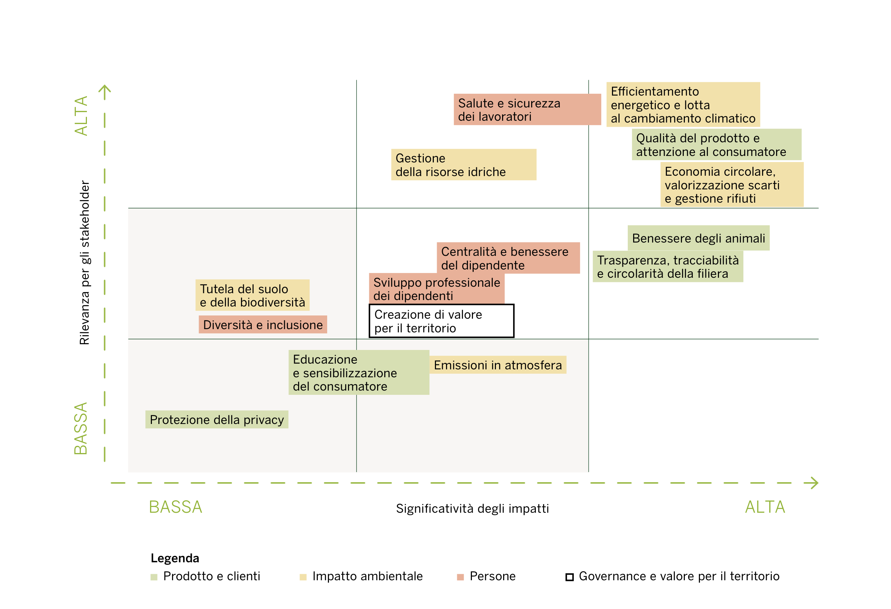
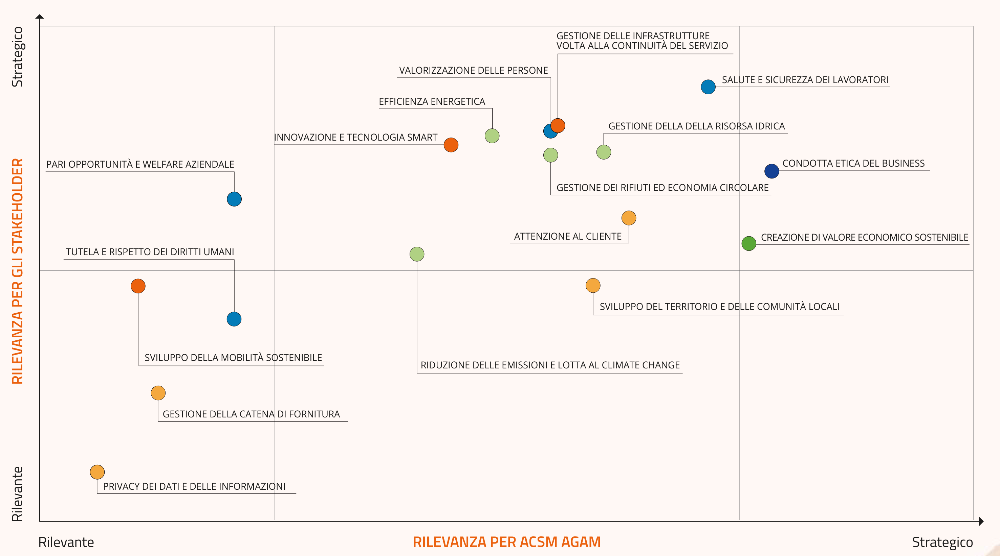
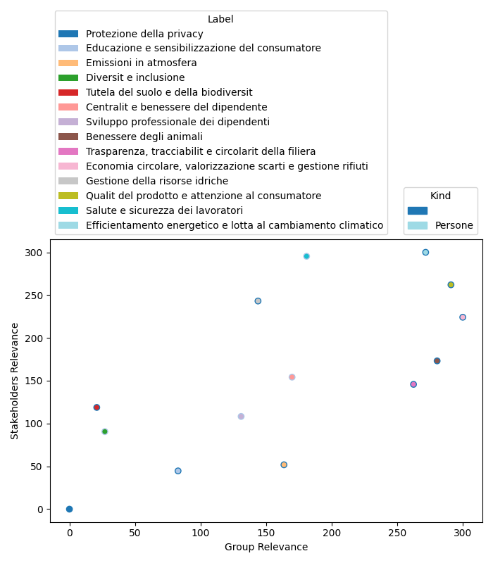

# SustiNEO Extractor
A `python` software for materiality matrices extraction.

## Table of Contents
- [Description](#description)
- [Usage](#usage)
  - [Dependencies](#dependencies)
  - [Installation](#installation)
  - [Tested environments](#tested-environments)
  - [Execution](#execution)
  - [Docker](#docker)
  - [Output](#csv-format-file)
- [Addendum: PDF Converter](#addendum-pdf-converter)
- [Author](#author)


## Description
This `python` software can be used to extract data from block-form materiality matrices, in box-type form and in blob-type form, like the ones that follow.





You can obtain an output like the following:



The software follows 5 different passes:
1. [Plot/legend subdivision](#1-plotlegend-subdivision)
2. [Plot interpretation](#2-plot-interpretation)
3. [Legend interpretation](#3-text-detection)
4. [Final export](#4-final-export)

### 1. Plot/legend subdivision
At first, in order to have higher scalability, the input image is **divided** into two section: plot and lagend. 

This process differs following the type of the plot image in input.

#### Box-type
In this case, a "bounding box" approach has been choosen: using the **Hough transform** (after binarizing the input image), the software is able to detect all the lines on the image. Being a $(3 \times 3)$-blocks plot, is very easy to detect these lines.\
Next, the intersections are computed and between them, the software detects the minimum-area box of the plot, the one on the bottom-left. Using this rectangle, is then used a 1:3 aspect ratio to find the entire area of the plot: in particular, the subdivision is done using the three limiting vertices of the rectangle including the plot (top-left, bottom-left, top-right). 


Finally, the cropped plot and legend sections of the image are passed as input to the data-extraction module of the software.

#### Blob-type
In this case, a different approach - based on a **blob detector** - has been choosen. 
Using the detector, the software finds all the blobs (circular forms) that have the same coordinates, disposed both in horizontal and in vertical.\
To distinguish the legend's blob from the actual plot's blob (representing the values in $(x,y)$ coordinates), the software counts the number of blobs that share the same coordinare; statistically, if more than two, then we are in presence of a legend.

Next, the software detects the first and the last blob composing the legend, and using them as delimiters, it "crops" the legend away from the input image.

### 2. Plot interpretation
#### 2.1. Shape detection
##### Box-type
At first, the data-extraction `PlotOCR_Box` class (that inherits from `OCR` class) object does a shape detection operation onto the plot file data.\
In particular, after **binarizing** the input plot (again, but using a different threshold in order to obtain the shapes of the rectangles in the image) and using a **$(2 \times 2)$-kernel dilatation** (in order to remove the thin lines), all the corners are extracted.

There are two different cases:
- **simple case**, rectangle on the plot: the limiting vertices (top-left and bottom-right ones) of the rectangle are detected and then used to define `LabelBox`-class objects for every detected rectangle;
- **complex case**, irregular form on the plot: this is the case in which the rectangles are joined between them; here, the software analyzes and then subdivides the 8-edges irregular shape, in order to obtain two rectangles and proceed like in the previous case.

##### Blob-type
At first, the data-extraction `PlotOCR_Blob` class (that inherits from `OCR` class) object does a shape detection operation onto the plot file data.\
Again, after **binarizing** the input plot and using a **$(2 \times 2)$-kernel dilatation**, all the blobs are detected using a **blob detector**; however, in this passage a different radius threshold is set in order to discard all keypoints detected from the letters of the labels. 

#### 2.2. Text detection
Another **threshold** operation is done, but this time in manner to leave only the text and ignore the shape. Also during this pass we have two different cases:
1. **black text** on **colored images**: the binarized image has exclusively black text, without any background (as it is discarted during the thresholding);
2. **white text** on **colored images**: the binarized image has white text on black boxes.

As the OCR module works better with black-texted images, in the 2nd case the image is converted to negative in order to proceed like in the 1st one. 

Next, calling the `pyTesseract` module (python implementation for Google's *Tesseract OCR*), we are able to obtain a **dictionary** containing different informations about the words on the box, their respective pixel-coordinates, and bounding boxes informations.\
All these informations are used to instantiate `TextBox` class objects for every detected word.

##### Box-type
The bounding boxes and respective coordinates are used to detect which word is contained in which colored box, and thus in which `LabelBox`, forming then the label.

##### Blob-type
Every `TextBox` is put into a `LabelBoxColorless` according to this heuristic:

- if the current word has a distance $d_x < t_x$ from next one, then they are on the same row;
- else, the next word is in the following row if the distance between the first word of the first row has a distance $d_y < t_y$ from the next one.

Finally, we join each `BlobBox` to the nearest `LabelBoxColorless` (using the euclidean distance between the center of the blob and the center of the `LabelBoxColorless`).

#### 2.3 Legend link
Meanwhile, for every rectangle or blob in the plot, the color data is saved(both in RGB and HSV format) and then stored in the `color_rgb` and `color_hsv` attributes of every single `TextBox`-class objects. This information will be used in the next part.

All the `LabelBox`es or `BlobBox`es data are then given as output.

### 3. Legend interpretation
The extraction now involves the legend section previously cropped from the source image. The data is passed as input to the `LegendOCR` class (inherits from `OCR` class) object.
Its behavior is similar to the previously analyzed class' one, but this time we don't consider `LabelBox`es, as we don't have actual rectangles in the image.

At first, calling the `pyTesseract` module, we obtain the same kind of dictionary obtained in the previous pass.
In the legend, the data appears in the following manner:

```
+---------------+
| Colored shape |   Label text
+---------------+
```

So, first we have to store the colored shape's position: this can be done converting the legend in HSV color-space format, and then taking the non-zero point for every color in `colors_hsv` obtained during the plot extraction pass.
Next, we can process the legend; kwowing that the first `TextBox` of every single legend-string is next near to the color shape, the euclidean distance between them is minimum; to avoid errors, we can here use a threshold. Given this minimum distance, we know that the first word of the label is of that label of the legend: so, we can create a `LegendBox` object identified by the position of the colored shape.

All the `LegendBox`es data are then given as output.

### 4. Final export
During the final export, the `LabelBox`es and the `LegendBox`es data are passed as input to the `Exporter` class object.\
If there is no Legend, the legend-data is set as None and then discarded.

The following operations are then done.

#### 4.1. Normalization
The coordinates of the `LabelBox`es' middle points are **normalized** in the range $[0,300]$, in order to have 100 units for each block (vertically and horizontally).

#### 4.2. CSV export
The collected data are gathered in a `pandas` **dataframe** and then exported in a `csv` file on the disk.

#### 4.3 PNG export
The `pandas` dataframe data are used to generate a plot using the `matplotlib` module, that is then saved on the disk.

##### 

## Usage
### Dependencies
- Python 3.10
- `tesseract-ocr` package
- `matplotlib` python module
- `pandas` python module
- `opencv-python` python module
- `pytesseract` python module
- `pymupdf` python module

### Tested Environments
| Environment | Works |
|:-----------:|:-----:|
| Linux | ✅ |
| Docker | ✅ |
| Windows | ✅ |
| MacOS | ✅ |

### Installation
After ensuring that Python $\geq$ 3.10 is installed on your personal environment, install the required modules through the command:

```
pip install -r requirements.txt
```

Then, make a `git clone` of this repository or simply download it.

#### Linux
You need to install the `tesseract-ocr` package, using the package manager of your distribution.\
Example with Debian:

```
sudo apt install tesseract-ocr -y
```

If you want to add support for your language, you have to install the appropriate language

```
sudo apt install tesseract-data-<LAN> -y
```

where `LAN` are the first three characters of your language.

Example with Italian language:

```
sudo apt install tesseract-data-ita -y
```

#### Windows
To install the `tesseract-ocr` package, you can use `winget` from Windows Terminal:

```
winget install tesseract-ocr
```

Then, ensure that `tesseract-ocr` root folder is included in your `PATH` and reboot.
To add language support, download the `<LAN>.traineddata` pre-trained model from the following [link](https://github.com/tesseract-ocr/tessdata), where `LAN` are the first three characters of your language, and put it in `tesseract-ocr` root folder.

#### MacOS
Use brew package manager to install the `tesseract` package:

```
brew install tesseract
```

Then, add support to all the other languages installing the `tesseract-lang` package:

```
brew install tesseract-lang
```

### Execution
Run the `main.py` script in the root of the cloned folder to execute the program.

#### Help
```
python main.py -h

usage: sustineo_extractor [-h] [-l LANGUAGE] [-t TYPE] [-d] [-s SIZE_FACTOR] pathname

This program extracts data from materiality matrices and reinterprets them in a more undestandable form.                                            
Author: nebuchadneZZar01 (Michele Ferro)                                            
GitHub: https://github.com/nebuchadneZZar01/

positional arguments:
  pathname

options:
  -h, --help            show this help message and exit
  -l LANGUAGE, --language LANGUAGE
                        language of the plot to extract (default="ita")
  -t TYPE, --type TYPE  type of plot from where extract the informations (possible types=["box", "blob"], default="box")
  -d, --debug-mode      activate the visualization of the various passes
  -s SIZE_FACTOR, --size-factor SIZE_FACTOR
                        if used in debug mode, the image sizes will be divided by the choosen scale factor for a better visualization on lower resolution screens (default=1.5)
```

#### Input
The input files can be stored in the `/src` folder.

The `pathname` could be both the one of a file or of a directory containing more than one file; if the latter is used, then the algorithm is executed for every image in the directory.

```
python main.py src/input.png
```

#### Output
The output exported data are esported in the `/out` folder.
Respectively, we will have the csv outputs in `/out/csv` and the png ones in `/out/img`.

```
.
|---- src
      |---- input.png
|---- out
      |---- csv
            |---- output.csv
      |---- img
            |---- output.png
```

##### CSV-format file
Given the input, the output dataset will be the following one:

| ID | Label | Kind | GroupRel | StakeRel | RankGroup | RankStake | RankAbsolute | Alignment |
|:--:|:-----:|:----:|:--------:|:--------:|:---------:|:---------:|:------------:|:---------:|
| 0 | Protezione della privacy | Unknown | 0.0 | 0.0 | 10.0 | 10.0 | 10.0 | 0.0 | 
| 1 | Educazione e sensibilizzazione del consumatore | Unknown | 82.84734133790738 | 44.6629213483146 | 7.6923076923076925 | 9.230769230769232 | 7.6923076923076925 | 27.000462310316212 | 
| 2 | Emissioni in atmosfera | Unknown | 163.63636363636363 | 51.82584269662922 | 5.384615384615385 | 8.461538461538462 | 5.384615384615385 | 79.06197756448665 |
| 3 | Diversit e inclusione | Persone | 27.015437392795885 | 90.58988764044943 | 8.461538461538462 | 7.6923076923076925 | 8.461538461538462 | 44.9539248803226 |
| 4 | Tutela del suolo e della biodiversit | Unknown | 20.840480274442537 | 118.82022471910113 | 9.230769230769232 | 6.153846153846154 | 9.230769230769232 | 69.28214171574304 |
| 5 | Centralit e benessere del dipendente | Persone | 169.81132075471697 | 154.2134831460674 | 4.615384615384616 | 4.615384615384616 | 4.615384615384616 | 11.029336744922672 |
| 6 | Sviluppo professionale dei dipendenti | Persone | 130.96054888507717 | 108.2865168539326 | 6.923076923076923 | 6.923076923076923 | 6.923076923076923 | 16.032961806063316 |
| 7 | Benessere degli animali | Unknown | 280.4459691252144 | 173.1741573033708 | 1.5384615384615385 | 3.8461538461538463 | 1.5384615384615385 | 75.85262556939284 |
| 8 | Trasparenza, tracciabilit e circolarit della filiera | Unknown | 262.43567753001713 | 145.7865168539326 | 3.076923076923077 | 5.384615384615385 | 3.076923076923077 | 82.48341253377852 |
| 9 | Economia circolare, valorizzazione scarti e gestione rifiuti | Unknown | 300.0 | 224.1573033707865 | 0.0 | 3.076923076923077 | 0.0 | 53.628885089990966 |
| 10 | Gestione della risorse idriche | Unknown | 143.82504288164665 | 243.11797752808988 | 6.153846153846154 | 2.307692307692308 | 6.153846153846154 | 70.21070741241269
| 11 | Qualit del prodotto e attenzione al consumatore | Unknown | 290.99485420240137 | 262.07865168539325 | 0.7692307692307693 | 1.5384615384615385 | 0.7692307692307693 | 20.44684288593995
| 12 | Salute e sicurezza dei lavoratori | Persone | 180.87478559176674 | 295.36516853932585 | 3.8461538461538463 | 0.7692307692307693 | 3.8461538461538463 | 80.95692616286371 |
| 13 | Efficientamento energetico e lotta al cambiamento climatico | Unknown | 271.6981132075472 | 300.0 | 2.307692307692308 | 0.0 | 2.307692307692308 | 20.012456071317374 |

where:
- `Label` is the label of the point, extracted via OCR;
- `Kind` is the materiality component of that point, that is relative to the `Label`;
- `GroupRel` is the relevance of the materiality component according to the **group**;
- `StakeRel` is the relevance of the materiality component according to the **stakeholders**;
- `RankGroup` is the ranking (in $[0,10]$) given to the **group**, according to the relevance of the materiality component; the higher the ranking is, the higher is the relevance for the group;
- `RankStake` is the ranking (in $[0,10]$) given to the **stakeholders**, according to the relevance of the materiality component; the higher the ranking is, the higher is the relevance for the group;
- `RankAbsolute` is the ranking in ($[0,10]$) given to both the **group** and the **stakeholders**;
- `Alignment` is the alignment measure from the perfect alignment: the higher this value it is, the worst is the alignment compared to the perfect one.

##### PNG-format file
You can obtain an output like the following:


The perfect alignment line, passing through the origin, means the perfect alignment of the relevance of that materiality component according to the both the group and the stakeholders (that means, the relevance is the same accoring to both); the alignment distance is the distance to this perfect alignment.

### Docker
If you have Docker installed in your personal environment, in this repo is also provided a `Dockerfile`, making you able to build a docker image of the project, without installing any package.

Simply build the image using the Docker file with the `docker build` command, then run the build using the following command:

```
docker run -v path/to/project/folder/:/app sustineo-extractor src/input.png
```
## Addendum: SustiNEO PDF to Plot
In this repository is also included a `sustineo_pdf2plot.py` script, that allows to extract materiality matrices (in `PNG` format) from `PDF` files.

Its behaviour its very simple and can be summarized in the following passes.
1. **Interested string search**: in (almost) every sustainability report, the plot regarding materiality analysis is portrayed under the heading "materiality matrix" (depending on the plot language). The script searches every page where this string is present and ignores all the other ones.
2. **Interested page conversion**: of every selected page, are made two conversion.
      - RAW: The first conversion is a plain page in PNG format, which will be later used to make the cropping operations;
      - Vector: the second one is another PNG format image, which instead contains only the vectorial data (it's a textless page containing only the plot shapes); this data will be later used to detect the plot.
3. **Plot detection**: the plot is detected using the Hough transform on the image containing the vector data. The limiter vertices are given by the Hough lines intersections; their $(x,y)$ coordinates are then saved and used as points to crop the RAW image, in order to obtain the final plot. Then the plot is showed to the user.
4. **User adjustment**: the prompt asks the user if the cropped area actually contains the plot; if affermative, the image in saved to the disk, otherwise the user can adjust the crop, making this operation manually.

To invoke the script, use the command:
```
python sustineo_pdf2plot.py src/input.pdf
```

The `pathname` could be both the one of a file or of a directory containing more than one file; if the latter is used, then the algorithm is executed for every document in the directory.

## Author
- [@nebuchadneZZar01](https://github.com/nebuchadneZZar01) (Michele Ferro)